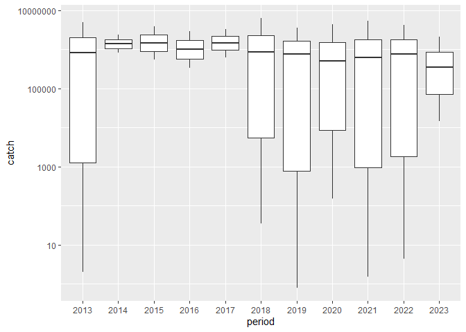
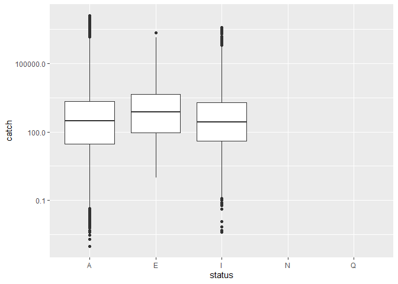

## Instructions
Answer the following questions and/or complete the exercises in RMarkdown. Please embed all of your code and push the final work to your repository. Your report should be organized, clean, and run free from errors. Remember, you must remove the `#` for any included code chunks to run.  

## Load the libraries

``` r
library("tidyverse")
library("janitor")
##library("naniar")
options(scipen = 999)
```

## About the Data
For this assignment we are going to work with a data set from the [United Nations Food and Agriculture Organization](https://www.fao.org/fishery/en/collection/capture) on world fisheries. These data were downloaded and cleaned using the `fisheries_clean.Rmd` script.  

Load the data `fisheries_clean.csv` as a new object titled `fisheries_clean`.

``` r
fisheries_clean <- read_csv("data/fisheries_clean.csv")
```

1. Explore the data. What are the names of the variables, what are the dimensions, are there any NA's, what are the classes of the variables, etc.? You may use the functions that you prefer.

``` r
glimpse(fisheries_clean)
```

```
## Rows: 1,055,015
## Columns: 9
## $ period          <dbl> 1950, 1951, 1952, 1953, 1954, 1955, 1956, 1957, 1958, …
## $ continent       <chr> "Asia", "Asia", "Asia", "Asia", "Asia", "Asia", "Asia"…
## $ geo_region      <chr> "Southern Asia", "Southern Asia", "Southern Asia", "So…
## $ country         <chr> "Afghanistan", "Afghanistan", "Afghanistan", "Afghanis…
## $ scientific_name <chr> "Osteichthyes", "Osteichthyes", "Osteichthyes", "Ostei…
## $ common_name     <chr> "Freshwater fishes NEI", "Freshwater fishes NEI", "Fre…
## $ taxonomic_code  <chr> "1990XXXXXXXX106", "1990XXXXXXXX106", "1990XXXXXXXX106…
## $ catch           <dbl> 100, 100, 100, 100, 100, 200, 200, 200, 200, 200, 200,…
## $ status          <chr> "A", "A", "A", "A", "A", "A", "A", "A", "A", "A", "A",…
```

2. Convert the following variables to factors: `period`, `continent`, `geo_region`, `country`, `scientific_name`, `common_name`, `taxonomic_code`, and `status`.

``` r
fisheries_clean %>%
  mutate(across(where(is.character), as.factor)) %>%
  mutate(period=as.factor(period))
```

```
## # A tibble: 1,055,015 × 9
##    period continent geo_region    country     scientific_name common_name       
##    <fct>  <fct>     <fct>         <fct>       <fct>           <fct>             
##  1 1950   Asia      Southern Asia Afghanistan Osteichthyes    Freshwater fishes…
##  2 1951   Asia      Southern Asia Afghanistan Osteichthyes    Freshwater fishes…
##  3 1952   Asia      Southern Asia Afghanistan Osteichthyes    Freshwater fishes…
##  4 1953   Asia      Southern Asia Afghanistan Osteichthyes    Freshwater fishes…
##  5 1954   Asia      Southern Asia Afghanistan Osteichthyes    Freshwater fishes…
##  6 1955   Asia      Southern Asia Afghanistan Osteichthyes    Freshwater fishes…
##  7 1956   Asia      Southern Asia Afghanistan Osteichthyes    Freshwater fishes…
##  8 1957   Asia      Southern Asia Afghanistan Osteichthyes    Freshwater fishes…
##  9 1958   Asia      Southern Asia Afghanistan Osteichthyes    Freshwater fishes…
## 10 1959   Asia      Southern Asia Afghanistan Osteichthyes    Freshwater fishes…
## # ℹ 1,055,005 more rows
## # ℹ 3 more variables: taxonomic_code <fct>, catch <dbl>, status <fct>
```

##3. Are there any missing values in the data? If so, which variables contain missing values and how many are missing for each variable?

``` r
## skip this one
```

4. How many countries are represented in the data?

``` r
fisheries_clean %>%
  distinct(country) 
```

```
## # A tibble: 249 × 1
##    country            
##    <chr>              
##  1 Afghanistan        
##  2 Albania            
##  3 Algeria            
##  4 American Samoa     
##  5 Andorra            
##  6 Angola             
##  7 Anguilla           
##  8 Antigua and Barbuda
##  9 Argentina          
## 10 Armenia            
## # ℹ 239 more rows
```

``` r
  #There are 249 countries represented in the data as it stands
```

5. The variables `common_name` and `taxonomic_code` both refer to species. How many unique species are represented in the data based on each of these variables? Are the numbers the same or different?

``` r
fisheries_clean %>%
  distinct(common_name, taxonomic_code)
```

```
## # A tibble: 3,722 × 2
##    common_name             taxonomic_code 
##    <chr>                   <chr>          
##  1 Freshwater fishes NEI   1990XXXXXXXX106
##  2 Crucian carp            140014109002   
##  3 Common carp             140014113401   
##  4 Grass carp(=White amur) 140018102601   
##  5 Silver carp             140018104601   
##  6 Bighead carp            140018104602   
##  7 Wuchang bream           140018105801   
##  8 Bleak                   140023102602   
##  9 Orfe(=Ide)              140023114204   
## 10 Common dace             140023114205   
## # ℹ 3,712 more rows
```

``` r
#There are 3,722 unique species
```

6. In 2023, what were the top five countries that had the highest overall catch?

``` r
fisheries_clean %>%
  select("period", "country", "catch")%>%
  filter(period=="2023") %>%
  slice_max(catch, n=5) 
```

```
## # A tibble: 5 × 3
##   period country                     catch
##    <dbl> <chr>                       <dbl>
## 1   2023 China                    2661523.
## 2   2023 Viet Nam                 2190211.
## 3   2023 Peru                     2047732.
## 4   2023 Russian Federation       1893580 
## 5   2023 United States of America 1433538
```

``` r
#Top 5 countries are China, Vietnam, Peru, Russion Federation, and USA.
```

7. In 2023, what were the top 10 most caught species? To keep things simple, assume `common_name` is sufficient to identify species. What does `NEI` stand for in some of the common names? How might this be concerning from a fisheries management perspective?

``` r
fisheries_clean %>%
  select("period", "common_name", "catch")%>%
  filter(period=="2023") %>%
  slice_max(catch, n=10) 
```

```
## # A tibble: 10 × 3
##    period common_name                       catch
##     <dbl> <chr>                             <dbl>
##  1   2023 Marine fishes NEI              2661523.
##  2   2023 Marine fishes NEI              2190211.
##  3   2023 Anchoveta(=Peruvian anchovy)   2047732.
##  4   2023 Alaska pollock(=Walleye poll.) 1893580 
##  5   2023 Alaska pollock(=Walleye poll.) 1433538 
##  6   2023 Freshwater fishes NEI          1040470 
##  7   2023 Largehead hairtail              910275 
##  8   2023 Freshwater fishes NEI           908467 
##  9   2023 Freshwater fishes NEI           902360 
## 10   2023 Chilean jack mackerel           852831
```

``` r
#NEI stands for not elsewhere included, from a fisheries management perspective I would imagine it would be quite concerning to see a high number of fish caught only found in one specific area. If you overfish that species you are basically screwed.
```

8. For the species that was caught the most above (not NEI), which country had the highest catch in 2023?

``` r
fisheries_clean %>%
  filter(period=="2023" & common_name=="Anchoveta(=Peruvian anchovy)") %>%
  group_by(period, common_name)
```

```
## # A tibble: 3 × 9
## # Groups:   period, common_name [1]
##   period continent geo_region country scientific_name common_name taxonomic_code
##    <dbl> <chr>     <chr>      <chr>   <chr>           <chr>       <chr>         
## 1   2023 Americas  South Ame… Chile   Engraulis ring… Anchoveta(… 121003104208  
## 2   2023 Americas  South Ame… Ecuador Engraulis ring… Anchoveta(… 121003104208  
## 3   2023 Americas  South Ame… Peru    Engraulis ring… Anchoveta(… 121003104208  
## # ℹ 2 more variables: catch <dbl>, status <chr>
```

``` r
#Chile had the highest catch.
```

9. How has fishing of this species changed over the last decade (2013-2023)? Create a  plot showing total catch by year for this species.


``` r
fisheries_clean %>%
  filter(period %in% 2013:2023 & common_name=="Anchoveta(=Peruvian anchovy)") %>%
  mutate(period=as.factor(period)) %>%
  group_by(period, common_name) %>%
  ggplot(mapping = aes(x=period, y=catch))+
  scale_y_log10()+
  geom_boxplot()
```

```
## Warning in scale_y_log10(): log-10 transformation introduced infinite values.
```

```
## Warning: Removed 4 rows containing non-finite outside the scale range
## (`stat_boxplot()`).
```

<!-- -->

10. Perform one exploratory analysis of your choice. Make sure to clearly state the question you are asking before writing any code.

``` r
#Does status have any corelation to catch?
fisheries_clean %>%
  mutate(status=as.factor(status)) %>%
  ggplot(mapping = aes(y=catch, x=status))+
  scale_y_log10()+
  geom_boxplot()
```

```
## Warning in scale_y_log10(): log-10 transformation introduced infinite values.
```

```
## Warning: Removed 478217 rows containing non-finite outside the scale range
## (`stat_boxplot()`).
```

<!-- -->

## Knit and Upload
Please knit your work as an .html file and upload to Canvas. Homework is due before the start of the next lab. No late work is accepted. Make sure to use the formatting conventions of RMarkdown to make your report neat and clean!  
